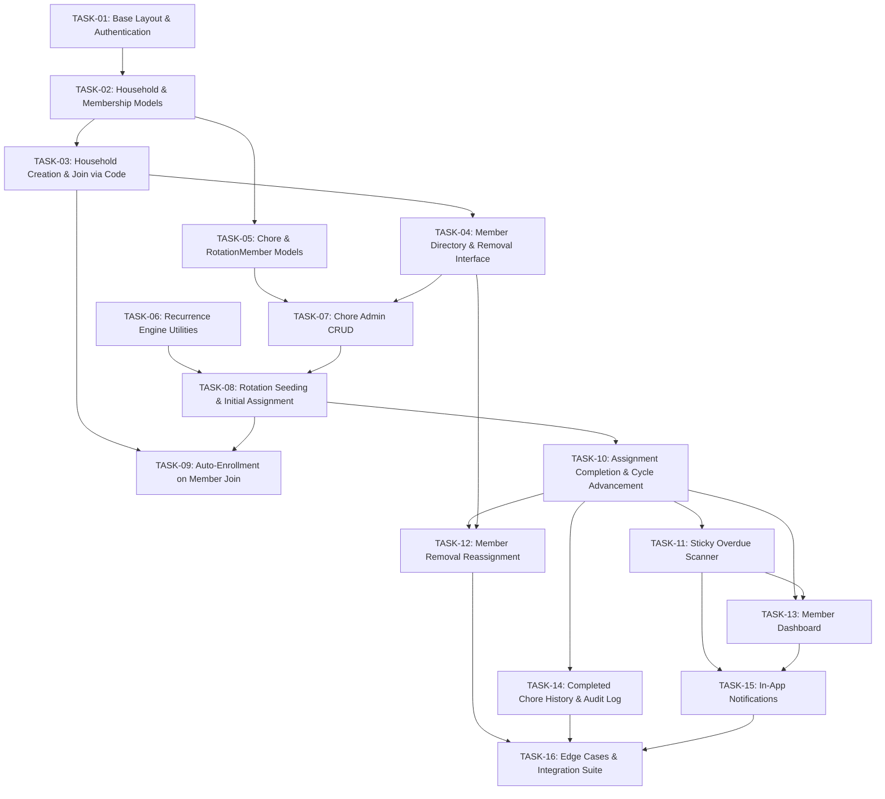

# Implementation Backlog: Shared Household Chores

This backlog translates the specification and architecture outlined in [_docs/plan.md](plan.md) into a small, practical, and testable sequence of implementation tasks for Django.

---

## Technical Baseline & Conventions

- **Framework:** Django 6.x (configured in `household_chores` with app `chores`).
- **Dependency Management:** `uv` (`pyproject.toml`, `uv.lock`).
- **Database:** SQLite for local development (`BASE_DIR / 'db.sqlite3'`).
- **Authentication:** Standard Django `django.contrib.auth.models.User`.
- **Date Handling:** Standard calendar dates (`datetime.date`, `YYYY-MM-DD`) rather than time-of-day timestamps for chore scheduling.
- **Transactions & Concurrency:** Use `django.db.transaction.atomic()` and `select_for_update()` for rotation transitions, assignment generation, and member removal reassignments.
- **Testing Approach:** Each task must be accompanied by focused unit or integration tests verifying happy paths, permissions, and edge cases.

---

## Dependency Graph & Milestone Overview

---

## Phase 1: Foundation, Authentication & Household Setup

### TASK-01: Base Layout, UI Styling & Authentication Views
- **Goal:** Set up user registration, login, logout, and responsive base navigation template.
- **Scope:**
  - Create `templates/base.html` with clean responsive layout, navigation header, and message flash containers.
  - Implement registration view/form using `UserCreationForm`.
  - Wire Django authentication views (`LoginView`, `LogoutView`) with proper redirect targets.
  - Add navigation state (authenticated user vs. guest).
- **Dependencies:** None.
- **Verification & Acceptance Criteria:**
  - Guests can sign up with username, email, and password.
  - Users can log in and log out with clear feedback messages.
  - Unauthenticated access to protected routes redirects to login.
  - Automated tests in `chores/tests/test_auth.py` for registration, login, logout, and redirect behaviors.

---

### TASK-02: Household and HouseholdMembership Models
- **Goal:** Define database models for households and user memberships with join codes.
- **Scope:**
  - Implement `Household` model (`name`, `join_code`, `admin` FK to `User`, `created_at`).
  - Implement `HouseholdMembership` model (`user` FK to `User`, `household` FK to `Household`, `is_admin`, `joined_at`).
  - Add unique constraint on `(user, household)` and unique alphanumeric join code generator utility (e.g. 6-8 uppercase characters).
  - Register models in Django Admin.
- **Dependencies:** TASK-01.
- **Verification & Acceptance Criteria:**
  - Running `python manage.py makemigrations` and `migrate` succeeds without warnings.
  - Unique join codes are generated automatically on household creation.
  - Automated tests in `chores/tests/test_models.py` verifying model constraints, join code uniqueness, and cascade behaviors.

---

### TASK-03: Household Creation & Join via Code Views
- **Goal:** Allow users to create a new household or join an existing one using an invite code.
- **Scope:**
  - Forms: `HouseholdCreationForm` and `HouseholdJoinForm`.
  - Views:
    - Create household view: creates `Household`, assigns creator as `admin`, creates `HouseholdMembership` with `is_admin=True`.
    - Join household view: accepts `join_code`, looks up matching household, creates `HouseholdMembership` (`is_admin=False`).
  - Add helper/context processor or session middleware to track the user's active household.
- **Dependencies:** TASK-02.
- **Verification & Acceptance Criteria:**
  - User can create a household and is redirected to the household view as admin.
  - Second user can enter valid join code and become a member.
  - Entering invalid or expired join code shows an appropriate validation error.
  - Automated tests for both household creation and join flows with permissions and validation checks.

---

### TASK-04: Household Member Directory & Admin Removal View
- **Goal:** Enable housemates to see who is in the household and allow the admin to remove members.
- **Scope:**
  - Member roster view displaying household members, join dates, and admin designation.
  - Admin-only member removal action with a confirmation prompt.
  - Permission checks: ensure only the household admin can remove non-admin members; admins cannot remove themselves without transfer.
  - *(Note: Reassignment of active chore assignments will be hooked into this in TASK-12 once chore assignments exist).*
- **Dependencies:** TASK-03.
- **Verification & Acceptance Criteria:**
  - All members can view the member directory.
  - Admin sees removal action buttons next to members; non-admins do not.
  - Non-admin attempting POST to removal endpoint receives 403 Forbidden.
  - Automated tests in `chores/tests/test_household_views.py` covering member directory display and removal permission checks.

---

## Phase 2: Chore Blueprint, Recurrence & Admin Management

### TASK-05: Chore and ChoreRotationMember Models
- **Goal:** Define models for chore definitions and turn-based rotation queues.
- **Scope:**
  - Implement `Chore` model:
    - `household` (FK to `Household`)
    - `title` (CharField)
    - `description` (TextField, optional)
    - `frequency_type` (Choices: `DAILY`, `INTERVAL_DAYS`, `WEEKLY`, `MONTHLY`)
    - `frequency_interval` (PositiveIntegerField, e.g. every 3 days, every 2 weeks)
    - `is_active` (BooleanField, default True)
    - `created_at` (DateTimeField)
  - Implement `ChoreRotationMember` model:
    - `chore` (FK to `Chore`)
    - `membership` (FK to `HouseholdMembership`)
    - `sequence_order` (PositiveIntegerField)
    - Unique constraints on `(chore, membership)` and `(chore, sequence_order)`
  - Create and apply database migrations.
- **Dependencies:** TASK-02.
- **Verification & Acceptance Criteria:**
  - Migrations apply cleanly.
  - Unique constraints prevent duplicate members in the same rotation or conflicting sequence numbers.
  - Unit tests in `chores/tests/test_chore_models.py` verifying model validation and ordering constraints.

---

### TASK-06: Recurrence Calculation Engine
- **Goal:** Implement a pure date utility module to compute subsequent chore due dates.
- **Scope:**
  - Create `chores/services/recurrence.py`.
  - Function `calculate_next_due_date(frequency_type, frequency_interval, base_date)`:
    - `DAILY`: `base_date + timedelta(days=frequency_interval)`
    - `INTERVAL_DAYS`: `base_date + timedelta(days=frequency_interval)`
    - `WEEKLY`: `base_date + timedelta(weeks=frequency_interval)`
    - `MONTHLY`: calendar month addition with end-of-month clamp (e.g. Jan 31 + 1 month -> Feb 28/29).
  - All operations use `datetime.date` objects.
- **Dependencies:** None.
- **Verification & Acceptance Criteria:**
  - Comprehensive unit tests in `chores/tests/test_recurrence.py` covering:
    - Daily and multi-day interval calculations.
    - Weekly and bi-weekly calculations.
    - Month-end edge cases (31st to 30th/28th, leap years).
    - Preserving exact day-of-month where available.

---

### TASK-07: Chore Management Views (Admin CRUD)
- **Goal:** Allow household admins to create, view, edit, and toggle active status of chores.
- **Scope:**
  - `ChoreForm` with recurrence type and interval validation.
  - Views:
    - Chore list view (admin & members).
    - Chore creation view (admin-only).
    - Chore update/edit view (admin-only).
    - Chore delete/deactivate view (admin-only).
  - Enforce household boundaries (users can only access chores belonging to their household).
- **Dependencies:** TASK-04, TASK-05.
- **Verification & Acceptance Criteria:**
  - Admin can successfully create, update, and toggle chores.
  - Non-admin cannot create, edit, or delete chores (403 Forbidden).
  - Members from Household A cannot view or edit chores belonging to Household B.
  - Automated tests in `chores/tests/test_chore_crud.py`.

---

## Phase 3: Rotation Queue, Assignment Engine & Onboarding

### TASK-08: Rotation Seeding & Initial Chore Assignment
- **Goal:** Automatically populate rotation queues with all members (including admin) and schedule the first assignment when a chore is created.
- **Scope:**
  - Implement `ChoreAssignment` model:
    - `chore` (FK to `Chore`)
    - `assigned_to` (FK to `HouseholdMembership`)
    - `due_date` (DateField)
    - `status` (Choices: `PENDING`, `COMPLETED`, `OVERDUE`)
    - `completed_at` (DateTimeField, nullable)
    - `completed_by` (FK to `HouseholdMembership`, nullable)
  - Create service function `initialize_chore_rotation(chore, initial_due_date)`:
    - Collects all current household members (admin is included per business invariant).
    - Populates `ChoreRotationMember` with sequence numbers `0..N-1`.
    - Creates the initial `ChoreAssignment` with `status='PENDING'`, assigned to sequence 0.
  - Hook into chore creation workflow.
- **Dependencies:** TASK-05, TASK-06, TASK-07.
- **Verification & Acceptance Criteria:**
  - On chore creation, rotation queue contains all existing members in deterministic order.
  - Admin is an active participant in the rotation queue.
  - First `ChoreAssignment` is created with `status='PENDING'` and assigned to the first member.
  - Automated tests in `chores/tests/test_assignment_engine.py`.

---

### TASK-09: Automatic Rotation Enrollment for New Members
- **Goal:** Automatically append newly joined housemates to existing active chore rotations.
- **Scope:**
  - Create service/signal hook triggered upon successful `HouseholdMembership` creation via join code.
  - For each active `Chore` in the household:
    - Compute `max(sequence_order) + 1` (or 0 if queue was empty).
    - Create `ChoreRotationMember` linking the new member.
- **Dependencies:** TASK-03, TASK-08.
- **Verification & Acceptance Criteria:**
  - When a user joins via join code, they are immediately present in rotation queues for all active chores in that household.
  - Existing pending assignments and sequence orders of previous members remain undisturbed.
  - Inactive chores are excluded.
  - Automated tests in `chores/tests/test_member_onboarding.py`.

---

### TASK-10: Assignment Completion & Rotation Cycle Advancement
- **Goal:** Enable assignees to complete chores and automatically trigger the next rotation cycle.
- **Scope:**
  - Implement service `complete_assignment(assignment_id, completed_by_membership)`:
    - Wraps in `transaction.atomic()` with `select_for_update()`.
    - Updates assignment: `status='COMPLETED'`, `completed_at=now()`, `completed_by=completed_by_membership`.
    - Identifies next member in `ChoreRotationMember` queue (wraps around to index 0 after the last member).
    - Calculates next `due_date` using `calculate_next_due_date`.
    - Creates next `ChoreAssignment` with `status='PENDING'`.
  - POST endpoint / view for marking a chore completed with immediate user feedback.
- **Dependencies:** TASK-06, TASK-08.
- **Verification & Acceptance Criteria:**
  - Marking a chore complete updates the record and creates the next pending assignment.
  - The rotation correctly advances to the next member and loops back to the beginning after the last member.
  - Non-members of the household cannot complete assignments.
  - Automated tests in `chores/tests/test_completion_flow.py` verifying state transitions, rotation loop, and idempotency.

---

### TASK-11: Sticky Overdue Policy & Daily Task Scanner
- **Goal:** Implement the sticky overdue policy where delinquent chores stay assigned until completed.
- **Scope:**
  - Implement service `mark_overdue_assignments(reference_date=None)`:
    - Finds all `ChoreAssignment` records where `status='PENDING'` and `due_date < reference_date` (defaults to `date.today()`).
    - Updates status to `OVERDUE`.
    - **Invariant check:** Does not generate subsequent assignments or advance rotation while a chore is overdue.
  - Management command: `python manage.py check_overdue_chores`.
  - Ensure completing an `OVERDUE` assignment in `complete_assignment` properly clears the overdue state and advances rotation normally.
- **Dependencies:** TASK-10.
- **Verification & Acceptance Criteria:**
  - Chores past their due date transition to `OVERDUE`.
  - An overdue chore remains assigned to the delinquent member; no new assignment is generated until completed.
  - Completing an overdue chore advances rotation to the next assignee.
  - Automated tests in `chores/tests/test_overdue_policy.py`.

---

### TASK-12: Member Removal Reassignment & Queue Re-indexing
- **Goal:** Safely remove a member by reassigning active chores to the next member and re-indexing queues.
- **Scope:**
  - Implement service `remove_member_from_household(membership_to_remove, admin_user)`:
    - Validates requestor is household admin.
    - Finds all active assignments (`PENDING` or `OVERDUE`) assigned to `membership_to_remove`.
    - For each affected assignment:
      - Finds the removed member's position in that chore's `ChoreRotationMember`.
      - Identifies the next eligible member in the rotation cycle.
      - Reassigns `ChoreAssignment.assigned_to` to that next member, keeping original `due_date`.
    - Removes `membership_to_remove` from all `ChoreRotationMember` records.
    - Re-indexes remaining `ChoreRotationMember.sequence_order` to eliminate gaps (`0, 1, 2...`).
    - Deletes or deactivates `membership_to_remove`.
- **Dependencies:** TASK-04, TASK-10.
- **Verification & Acceptance Criteria:**
  - Pending and overdue chores of removed members are reassigned to the next member in sequence.
  - Original due date is preserved upon reassignment.
  - Rotation queues for remaining members are re-indexed cleanly without gaps.
  - Automated tests in `chores/tests/test_member_removal_reassignment.py`.

---

## Phase 4: User Dashboard, History & Notifications

### TASK-13: Member Dashboard ("My Chores", "All Chores", "Upcoming Rotations")
- **Goal:** Provide a central dashboard for housemates to view assignments and perform quick completion.
- **Scope:**
  - View and template `chores/dashboard.html`:
    - **"My Chores":** Chores assigned to current user, grouped into *Overdue* (red alert badge), *Due Today*, and *Upcoming*.
    - **"All Household Chores":** Overview of all active household chores, current assignee, and due date.
    - **"Upcoming Rotations":** Preview showing who is next in line for each chore.
    - **Quick Completion Action:** One-click button to mark an assigned chore complete with CSRF protection.
  - Ensure clear empty states when no chores are assigned or created yet.
- **Dependencies:** TASK-10, TASK-11.
- **Verification & Acceptance Criteria:**
  - Dashboard accurately renders chores partitioned by user assignment and urgency.
  - Clicking "Mark Complete" updates chore status and refreshes dashboard immediately.
  - Only assigned member or admin can complete chores.
  - Automated tests in `chores/tests/test_dashboard_view.py`.

---

### TASK-14: Completed Chore Audit Log & History View
- **Goal:** Provide a transparent, filterable history log of completed chores.
- **Scope:**
  - View and template `chores/history.html`:
    - List of completed `ChoreAssignment` records ordered by `completed_at` descending.
    - Display chore title, assigned member, completed-by member, due date, and completion date.
    - Filter controls: filter by specific chore, filter by member, and date range.
- **Dependencies:** TASK-10, TASK-13.
- **Verification & Acceptance Criteria:**
  - Only completed chores appear in the audit log.
  - Filtering by member and by chore returns correct subset of records.
  - Results are paginated if list exceeds page limit.
  - Automated tests in `chores/tests/test_history_view.py`.

---

### TASK-15: In-App Notifications (Reminders & Admin Overdue Alerts)
- **Goal:** Alert members about approaching chores and notify admins about overdue chores.
- **Scope:**
  - Implement `Notification` model:
    - `recipient` (FK to `User`)
    - `household` (FK to `Household`)
    - `assignment` (FK to `ChoreAssignment`, nullable)
    - `notification_type` (Choices: `REMINDER`, `OVERDUE`)
    - `message` (CharField)
    - `is_read` (BooleanField, default False)
    - `created_at` (DateTimeField)
  - Service functions:
    - Generate reminders for assignees when chore is due today.
    - Generate overdue alert for admin when chore becomes `OVERDUE`.
  - Header notification bell widget with unread count and dropdown / mark-as-read endpoint.
- **Dependencies:** TASK-11, TASK-13.
- **Verification & Acceptance Criteria:**
  - Admin receives notification when an assignment transitions to `OVERDUE`.
  - Member receives notification when an assigned chore is due.
  - Marking a notification as read decrements the unread count.
  - Automated tests in `chores/tests/test_notifications.py`.

---

## Phase 5: Edge Cases, Integration & Hardening

### TASK-16: Edge Cases Validation & End-to-End Integration Suite
- **Goal:** Run end-to-end integration tests covering all critical edge cases identified in the specification.
- **Scope:**
  - Test scenario 1: **Single-Member Household (Admin Only)**
    - Household has only 1 member.
    - Creating and completing chores repeatedly rotates back to admin with correctly advancing due dates.
  - Test scenario 2: **Reduction to Single Member**
    - All non-admin members removed; admin absorbs remaining rotations seamlessly.
  - Test scenario 3: **Late Overdue Completion**
    - Chore completed days after due date; verify next due date calculation avoids past-due traps.
  - Test scenario 4: **Chore Deletion / Deactivation with Active Assignments**
    - Active assignments handled cleanly when chore is deactivated or deleted.
  - Test scenario 5: **Concurrent Completion Attempts**
    - Double submission / race condition on completing the same assignment produces deterministic single next assignment.
  - Test scenario 6: **Multi-Household Isolation**
    - Verify strict data isolation across separate households.
- **Dependencies:** TASK-01 through TASK-15.
- **Verification & Acceptance Criteria:**
  - All integration tests pass via `python manage.py test`.
  - Zero test regressions across entire test suite.
  - Code coverage satisfies all behavioral invariants from `_docs/plan.md`.
