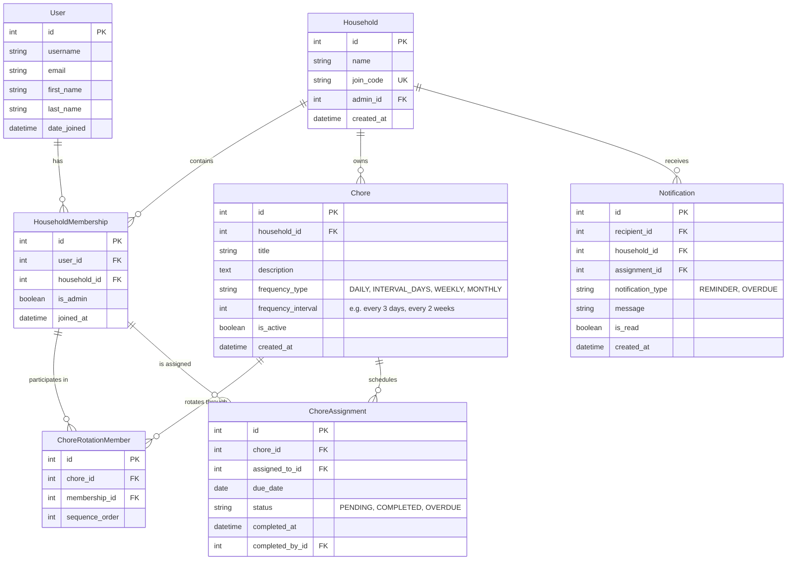
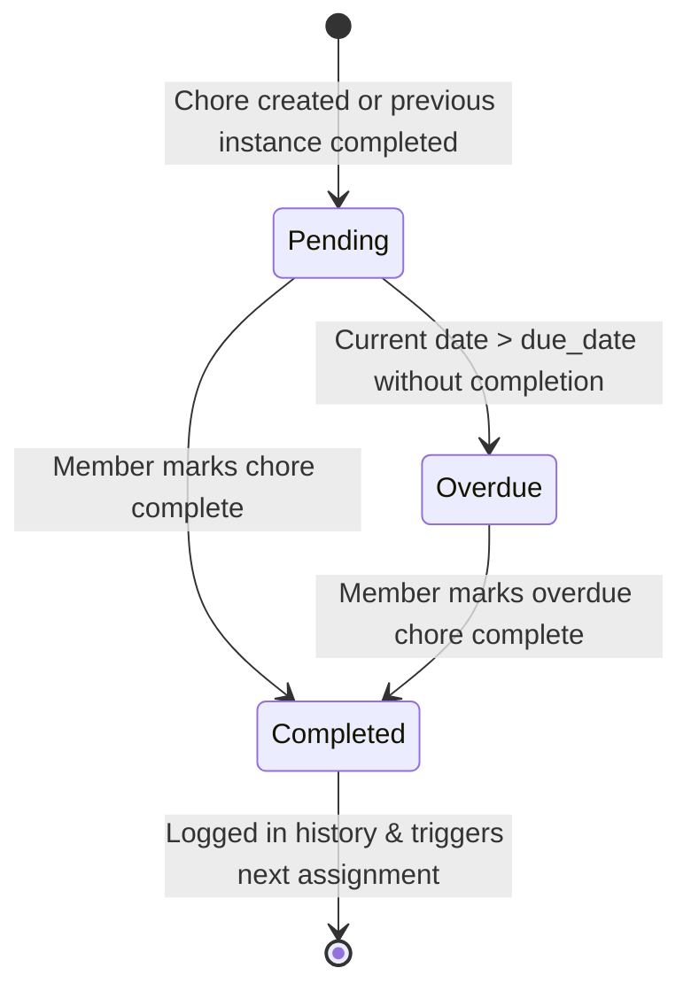

# Implementation Plan: Shared Household Chores

## 1. Executive Summary & Problem Statement

In shared living arrangements (apartments, student housing, shared houses), chore distribution is a frequent source of tension and neglect. The fundamental issue is ambiguity: **housemates do not know whose turn it is to do a specific chore**, when it is due, or whether it was completed.

The **Shared Household Chores** application eliminates guesswork by automating chore rotation schedules, tracking completion history, and notifying members and administrators of upcoming and overdue tasks.

---

## 2. Scope & Target MVP Features

### Feature 1: Household Management
- **Single Administrator:** Each household is governed by one admin who has administrative privileges (managing chores, removing members).
- **Join Code System:** An alphanumeric join code generated upon household creation enables housemates to register and join effortlessly.
- **Member Roster:** All members can view the current house roster and administrative status.
- **Member Removal:** The admin can remove a member from the household at any time.

### Feature 2: Chore Management
- **Chore CRUD:** Admin can create, read, update, and delete chores.
- **Configurable Frequencies:** Chores can be scheduled across recurring intervals (Daily, Every X Days, Weekly, Bi-weekly, Monthly).
- **Chore Details:** Title, detailed description/instructions, estimated effort/notes, and active status.

### Feature 3: Chore Assignments & Completion
- **Automated Turn-Based Rotation:** Every chore maintains an ordered queue of assignees. Each occurrence is assigned to the next eligible member in the cycle.
- **Upcoming Chores Dashboard:** Members see:
  - Chores currently assigned to them with due dates.
  - Chores assigned to other housemates.
  - The upcoming rotation queue (who has it next).
- **Completion Tracking:** Assignees can mark their chore as completed with a single action, recording the timestamp.

### Feature 4: Notifications & Chore History
- **Upcoming Reminders:** Members receive visual/in-app reminders when an assigned chore's due date is approaching or today.
- **Overdue Alerts to Admin:** If a chore passes its due date without completion, the admin receives an overdue alert.
- **Completed Chore Audit Log:** A searchable/filterable history log of completed chores with the date completed, member who completed it, and original due date.

---

## 3. Core Business Logic & Behavioral Invariants

The application follows specific agreed behavioral rules to ensure fair and predictable operation:

| Rule | Expected Behavior | Implementation Detail |
| :--- | :--- | :--- |
| **Admin Participation** | The admin is an active chore participant. | The admin is automatically enrolled into chore rotation queues alongside standard members. |
| **New Member Onboarding** | New housemates participate in existing chores immediately. | When a user joins via the join code, they are appended to the rotation queue of all existing active chores in that household. |
| **Sticky Overdue Policy** | Delinquent chores do not roll over or disappear. | If a chore is overdue, it remains assigned to the delinquent member until marked complete. The rotation does not advance to the next person until the current assignment is fulfilled. |
| **Member Removal Reassignment** | Removing a housemate preserves operational continuity. | When a member is removed:  1. They are excised from all future rotation queues. 2. Any pending or overdue chore assigned to them is automatically reassigned to the next member in that chore's rotation queue. |
| **Date-Only Granularity** | Due dates are calendar days, not timestamps. | Due dates use `YYYY-MM-DD` formatting. Chores become due on a specific calendar date and are considered overdue at the conclusion of that date (midnight local household time). |

---

## 4. Data Model Design (Schema Architecture)

### Key Entity Specifications

1. **`Household`**
   - Holds the unique `join_code` (e.g., 6-8 character uppercase alphanumeric).
   - Points to the designated `admin` (`ForeignKey` or `OneToOne` relationship with `User`).

2. **`HouseholdMembership`**
   - Represents the association between a `User` and a `Household`.
   - Ensures users can only belong to one active household in the MVP (or facilitates future multi-household support cleanly).

3. **`Chore`**
   - Defines the chore blueprint and recurrence rules.
   - Frequency options:
     - `DAILY`
     - `INTERVAL_DAYS` (e.g., every 3 days)
     - `WEEKLY` (e.g., every week or every 2 weeks)
     - `MONTHLY` (e.g., once every calendar month)

4. **`ChoreRotationMember`**
   - Explicit ordering model mapping a `HouseholdMembership` to a `Chore` with an `order_index`.
   - Allows fine-grained control over rotation sequences, appending new members, and removing departed members.

5. **`ChoreAssignment`**
   - Represents a specific instance of a chore due on a particular calendar `due_date`.
   - States: `PENDING`, `COMPLETED`, `OVERDUE`.
   - Records `completed_at` timestamp and `completed_by` member for verification and history auditing.

6. **`Notification`**
   - Stores in-app alerts for users (e.g., upcoming chore reminders) and admins (e.g., overdue alerts).

---

## 5. Workflows & State Transitions

### A. Chore Assignment & Completion Lifecycle

1. **Assignment Generation:**
   - When a chore is created, its initial `ChoreAssignment` is generated with the initial assignee (index 0 in rotation) and calculated `due_date`.
2. **Completion & Advancement:**
   - When the assignee marks the assignment `COMPLETED`:
     - Assignment status updates to `COMPLETED` and timestamp is recorded.
     - The rotation sequence calculates the next member in line.
     - The next `due_date` is computed based on the chore's recurrence frequency (relative to the scheduled due date or completion date).
     - A new `ChoreAssignment` is created with status `PENDING`.
3. **Overdue Handling:**
   - Daily schedule or runtime check marks `PENDING` assignments past their `due_date` as `OVERDUE`.
   - An overdue alert is dispatched to the household admin.
   - **Crucial:** The chore remains with the current assignee until completed. Subsequent chore cycles wait for this blocker to clear.

### B. Member Addition Workflow
1. User enters household `join_code`.
2. `HouseholdMembership` created (non-admin).
3. System iterates over all active `Chore` records in the household.
4. User is appended to each chore's `ChoreRotationMember` queue with `order_index = max(order_index) + 1`.

### C. Member Removal Workflow
1. Admin triggers member removal.
2. System identifies all active `ChoreAssignment` records (status `PENDING` or `OVERDUE`) currently assigned to the removed member.
3. For each affected assignment:
   - Identify the removed member's position in `ChoreRotationMember`.
   - Find the next eligible member in rotation.
   - Reassign the `ChoreAssignment` to that next member (preserving the original due date).
4. Remove the user from all `ChoreRotationMember` records for the household.
5. Re-index sequence orders in `ChoreRotationMember` to prevent numbering gaps.
6. Delete or deactivate the `HouseholdMembership`.

---

## 6. Detailed Implementation Roadmap

### Phase 1: Environment Setup & Core Foundations
- [ ] Initialize Django project and virtual environment.
- [ ] Configure core settings, static files, and database connection.
- [ ] Setup authentication (Django built-in `auth.User` or customized user model).
- [ ] Implement Household models (`Household`, `HouseholdMembership`).
- [ ] Build household creation with unique join code generation.
- [ ] Build household join view via join code.
- [ ] Admin member removal interface with confirmation dialogs.

### Phase 2: Chore Blueprint & Recurrence Architecture
- [ ] Implement `Chore` and `ChoreRotationMember` models.
- [ ] Admin views for chore creation, editing, and deletion.
- [ ] Recurrence calculation utility (calculating subsequent `due_date` from chore frequency rules).
- [ ] Rotation queue initialization: when a chore is created, seed `ChoreRotationMember` with all current household members (including admin).
- [ ] Signal or hook for new member join: automatically append new member to existing chore queues.

### Phase 3: Assignment Engine & Rotation Logic
- [ ] Implement `ChoreAssignment` model.
- [ ] Logic for initial assignment generation upon chore creation.
- [ ] Mark-as-completed endpoint/view:
  - Transition assignment status to `COMPLETED`.
  - Advance rotation pointer to next member.
  - Generate the next recurring `ChoreAssignment`.
- [ ] Implement member removal reassignment logic (handling reassignment of orphaned `PENDING`/`OVERDUE` tasks).

### Phase 4: User Dashboard & Experience
- [ ] Member Dashboard view:
  - "My Chores" section (due today, upcoming, overdue).
  - "All Household Chores" view (visibility into who has what).
  - "Upcoming Rotations" preview.
- [ ] Quick completion action (one-click with visual confirmation).
- [ ] Clean, modern UI styling (responsive layout, clear status tags for PENDING / OVERDUE / COMPLETED).

### Phase 5: Notifications & Completed Chore History
- [ ] Overdue task scanner (Django management command and/or request-time check).
- [ ] Notification generation:
  - Due date reminders for assignees.
  - Overdue notifications targeting the household admin.
- [ ] In-app notification center/bell icon in the header.
- [ ] Completed Chore History view:
  - Chronological list of completed chores.
  - Filter by member, chore, or date range.

### Phase 6: Edge Cases, Quality Assurance & Polishing
- [ ] Comprehensive unit tests for:
  - Rotation advancing correctly through all members and looping back.
  - Member addition appending to all chores.
  - Member removal reassigning active chores cleanly without state corruption.
  - Overdue chores holding assignments until completed.
  - Household with only 1 member (admin only).
- [ ] Empty state designs (no chores created, no members yet, zero overdue chores).
- [ ] Error handling and validation (invalid join codes, permission checks preventing non-admins from modifying chores).

---

## 7. Edge Cases & Safeguards

1. **Household with a single member (Admin only):**
   - The chore rotation list has length 1.
   - Completing a chore rotates back to the admin for the next scheduled date.
2. **All members removed except Admin:**
   - Handled seamlessly since Admin is in the rotation.
3. **Chore deleted while assignment is pending or overdue:**
   - Active assignments for that chore are marked inactive or cascade-deleted depending on audit requirements (or chore is soft-deleted).
4. **Member marked overdue chore complete late:**
   - Next chore due date calculation: scheduled based on either (a) original due date + frequency, or (b) current completion date + frequency. (Recommended: calculate from completion date or clamp to next future recurrence so housemates are not penalized with back-to-back same-day chores).
5. **Simultaneous completion or race conditions:**
   - Use database transactions (`select_for_update`) when marking chores complete and creating the next assignment to avoid duplicate assignment generation.
